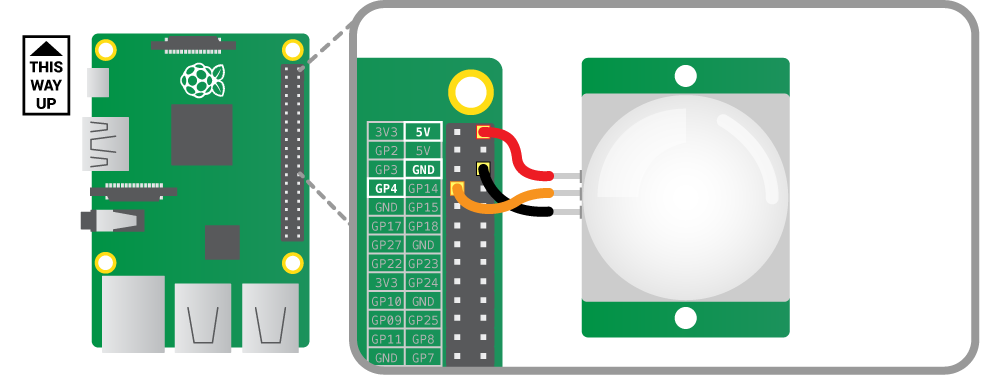

A Raspberry Pi Parent Detector
===============

How to use a Raspberry Pi to detect who's been in your room


A Raspberry Pi is so small that it can easily be hidden or concealed and that makes it the perfect tool for this kind of project.  The basic idea here is that we’re going to use motion detection to trigger video recording via the Raspberry Pi Camera Board.  You can then leave the Pi hidden in your room and see who's been caught on camera when you get home from School.

##Lesson objective
* Understand a Passive Infra Red motion sesnor
* Understand how to use the `picamera` Python module
* Understand how to record videos
* Understand how to play back videos

##Lesson outcome
*	To have built and tested a Raspberry Pi parent detector
*	Caught someone on camera
*	Gained experience in Python programming
*	Gained experience using the Raspberry Pi GPIO pins

##Time
*	1-2 hours

##Requirements
*	Raspberry Pi
*	Micro USB power adapter
*	An SD Card with Raspbian already set up through NOOBS
*	USB Keyboard
*	USB Mouse
*	HDMI cable
*	A Monitor or TV
*	Raspberry Pi Camera Board
*	PIR Motion Sensor Module (try [eBay](http://search.ebay.co.uk/pir+motion+sensor+module "eBay search"))
*	**Female** to **Female** jumper wires, at least 3 (try [eBay](http://search.ebay.co.uk/female+to+female+jumper+wires+solderless "eBay search"))

##Recommended
*	Camera Board 360 Gooseneck Mount (from [modmypi.com](https://www.modmypi.com/flexible-camera-mount "ModMyPi | RPi Camera Board 360 Gooseneck Mount"))

##Introduction - so what is a PIR module?

PIR stands for Passive Infra Red.  You’ve all seen these things before, they are tremendously common these days.  Most often found in the corners of rooms for burglar alarm systems.  All objects that are above absolute zero emit radiation in the form of infra red.  Infra red wavelengths are not visible to the human eye but they can be detected by the electronics inside one of these modules.

The sensor is regarded as passive because it doesn’t send out any signal in order to detect movement.  It adjusts itself to the infra red signature of the room it’s in and then watches for any changes.  Any object moving through the room will disturb the infra red signature and will cause a change to be noticed by the PIR module.


We don’t need to worry about its inner workings.  What we’re interested in are those three pins on it.  We can connect those to the Raspberry Pi GPIO pins.  One is for +5 volts, one is for ground and the other is the sensor pin (the middle pin on our one).  That pin will receive power whenever motion is detected by the PIR module.  We can then see that happening on the Raspberry Pi and take action accordingly.

## Step 1: Setting Up your Pi
First check that you have all the parts you need to get your Raspberry Pi set up and working.

- Raspberry Pi
- Micro USB power adapter
- An SD Card with Raspbian already set up through NOOBS
- USB Keyboard
- USB Mouse
- HDMI cable
- A Monitor or TV

**Activity Checklist**

1.	Place the SD card into the slot of your Raspberry Pi. It will only fit one way so be careful not to break the card. 
2.	Next connect the HDMI cable from the monitor (or TV) to the HDMI port on the Pi and turn on your monitor. 
3.	Plug the USB keyboard and mouse into the USB slots on the Pi.
4.	Plug in the micro USB power supply and you should see some text appear on your screen.
5.  When prompted to login type:

    ```
    Login: pi
    Password: raspberry
    ```

##Step 2: Connect the PIR motion sensor

This should ideally be connected with the Raspberry Pi turned off for safety.  Use the following command to shut down the Pi.

`sudo halt`

Wait for the ACT (activity) LED to stop blinking before turning off the power.



Refer to the diagram above for pin numbers.  If you look closely at the pins on your PIR module you’ll see some white text on the PCB near the base of each one.  `VCC` is for +5 volts input.  Take one of the **female** to **female** jumpers and connect the VCC pin to pin 2 (red) on the Pi, this will make the Pi give 5 volts of power to the PIR module.  Use another jumper to connect `GND` on the module to pin 6 (black) on the Pi, this completes the circuit and allows current to flow back out of the module into ground.  Now do the same for the sensor pin `OUT`, you can use any of the green pins on the Pi for this but I am going to use pin number 7 (since it’s the first general purpose one).

Note: If you have a different PIR module to our one then your pin layout might be different, this is why I refer you to the labels `VCC`, `GND` and `OUT`.

